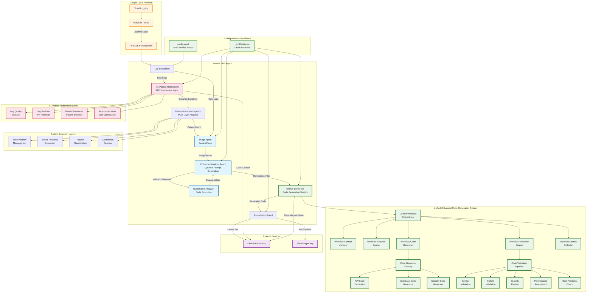

# Gemini SRE Agent: Autonomous Monitoring and Remediation

Welcome to the Gemini SRE Agent, an autonomous system designed to enhance your Google Cloud operations by intelligently monitoring logs and automating incident response. This project leverages the power of Google's Gemini models to bring advanced AI capabilities directly into your Site Reliability Engineering (SRE) workflows.

At its core, the Gemini SRE Agent acts as a proactive digital assistant, continuously observing your Google Cloud environment. When anomalies or critical events are detected in your logs, it doesn't just alert you; it initiates a structured process of analysis, generates intelligent code fixes using its unified enhanced code generation system, and proposes concrete remediation steps, culminating in automated GitHub Pull Requests. This approach aims to reduce manual toil, accelerate incident resolution, and improve the overall reliability of your cloud services.

Whether you're looking to streamline your incident management, gain deeper insights from your operational data, or simply explore the practical applications of generative AI in SRE, the Gemini SRE Agent offers a robust and extensible foundation. It's built with an emphasis on configurability, resilience, and clear observability, ensuring it can adapt to diverse cloud environments and operational needs.

Dive in to discover how this agent can transform your cloud log monitoring into an intelligent, automated, and resilient operation.

## System Architecture

The Gemini SRE Agent employs a sophisticated multi-model AI architecture with **enhanced dynamic prompt generation**, advanced pattern detection, and a **unified enhanced code generation system** for intelligent log monitoring and automated remediation:

### Multi-Model AI Strategy

The system leverages different Gemini models optimized for specific tasks:

- **Gemini Flash**: High-speed log triage and classification (cost-optimized)
- **Gemini Pro**: Deep analysis and code generation (accuracy-optimized)
- **Code Execution**: Empirical validation and quantitative analysis

### Enhanced Dynamic Prompt Generation System

The Gemini SRE Agent now features a **revolutionary dynamic prompt generation system** that automatically creates context-aware, specialized prompts for optimal code generation:

**Key Capabilities:**

- **Meta-Prompt Generation**: Uses Gemini Flash to generate optimized prompts for Gemini Pro, creating a "AI teaching AI" approach
- **Context-Aware Templates**: Automatically selects specialized prompt templates based on issue type (database errors, API failures, security issues, etc.)
- **Adaptive Strategy Selection**: Intelligently chooses between meta-prompt, specialized, or generic approaches based on issue complexity
- **Multi-Stage Validation**: Implements iterative refinement with validation feedback loops
- **Fallback Mechanisms**: Gracefully degrades to simpler approaches if advanced features fail
- **Performance Optimization**: Caching and similarity matching for cost-effective prompt generation

**Issue Type Specialization:**

- **Database Errors**: Specialized prompts for connection issues, query optimization, deadlocks
- **API Errors**: Authentication, rate limiting, endpoint failures, response validation
- **Security Issues**: Vulnerability assessment, access control, encryption problems
- **Service Errors**: Microservice communication, dependency failures, resource exhaustion
- **Infrastructure Issues**: Deployment problems, configuration errors, scaling issues

## Unified Enhanced Code Generation System

The Gemini SRE Agent now features a **comprehensive unified enhanced code generation system** that provides end-to-end automated remediation capabilities. This system represents a significant advancement in AI-powered incident response, combining specialized code generators, multi-level validation, performance optimization, and adaptive learning.

### Unified Code Generation Architecture

### Core Components

**Unified Workflow Orchestrator:**

- **Central Coordination**: Manages the entire code generation workflow from analysis to validation
- **Modular Architecture**: Broken down into specialized workflow components for maintainability
- **Async Optimization**: Concurrent task execution with priority queuing and retry mechanisms
- **Performance Monitoring**: Real-time metrics collection and trend analysis

**Enhanced Analysis Engine:**

- **Context-Aware Analysis**: Incorporates repository structure, recent commits, and issue patterns
- **Meta-Prompt Generation**: Uses AI to generate optimized prompts for better code generation
- **Adaptive Strategy Selection**: Chooses optimal analysis approach based on issue complexity
- **Fallback Mechanisms**: Graceful degradation to simpler approaches when needed

**Specialized Code Generators:**

- **API Code Generator**: Handles authentication, rate limiting, endpoint failures, response validation
- **Database Code Generator**: Manages connection issues, query optimization, deadlocks, migrations
- **Security Code Generator**: Addresses vulnerability assessment, access control, encryption problems
- **Factory Pattern**: Dynamic generator selection based on issue type and context

**Multi-Level Validation Pipeline:**

- **Syntax Validation**: Ensures generated code is syntactically correct
- **Pattern Validation**: Verifies code follows established patterns and conventions
- **Security Review**: Identifies potential security vulnerabilities and compliance issues
- **Performance Assessment**: Evaluates performance impact and optimization opportunities
- **Best Practices Check**: Ensures adherence to coding standards and architectural principles

**Performance & Cost Management:**

- **Adaptive Rate Limiting**: Smart API request management with circuit breaker patterns
- **Cost Tracking**: Real-time budget monitoring with configurable limits and alerts
- **Performance Monitoring**: Comprehensive metrics collection and trend analysis
- **Async Optimization**: Concurrent processing with intelligent task prioritization

**Learning & Improvement System:**

- **Generation History Tracking**: Records successful and failed code generation attempts
- **Pattern Learning**: Identifies successful patterns for future use
- **Feedback Integration**: Incorporates validation results to improve future generations
- **Performance Insights**: Provides actionable recommendations for system optimization

### Key Capabilities

**Intelligent Code Generation:**

- **Context-Aware**: Incorporates repository structure, recent changes, and issue patterns
- **Specialized Approaches**: Domain-specific generators for different types of issues
- **Multi-Model Strategy**: Leverages different Gemini models for optimal results
- **Iterative Refinement**: Continuous improvement based on validation feedback

**Quality Assurance:**

- **Multi-Level Validation**: Comprehensive checking from syntax to security
- **Automated Testing**: Integration with existing test suites and validation frameworks
- **Code Review Integration**: Generates pull requests with detailed explanations
- **Compliance Checking**: Ensures adherence to security and coding standards

**Performance Optimization:**

- **Concurrent Processing**: Async task execution for improved throughput
- **Intelligent Caching**: Context and response caching to reduce API costs
- **Resource Management**: Adaptive rate limiting and circuit breaker patterns
- **Cost Control**: Budget monitoring with automatic throttling and alerts

**Learning & Adaptation:**

- **Success Pattern Recognition**: Identifies and reuses successful generation patterns
- **Failure Analysis**: Learns from failed attempts to improve future generations
- **Performance Tuning**: Continuous optimization based on metrics and feedback
- **Adaptive Strategies**: Dynamic adjustment of generation approaches based on success rates

This unified system represents a significant advancement in AI-powered incident response, providing a complete end-to-end solution for automated code generation, validation, and deployment in SRE workflows.

## Key Features

- **Unified Enhanced Code Generation System:** Complete AI-powered code generation pipeline with specialized generators, validation, and learning capabilities for automated remediation.
- **AI-Enhanced Pattern Detection:** Multi-layer analysis engine enhanced with Gemini AI models for intelligent pattern recognition, confidence scoring, and context-aware analysis.
- **Gemini ML Pattern Refinement:** Advanced AI pipeline with quality validation, PII sanitization, smart caching, and cost optimization for production-ready AI analysis.
- **Enhanced Dynamic Prompt Generation:** Revolutionary AI-powered prompt generation system with meta-prompt optimization, context-aware templates, and adaptive strategy selection for superior code generation.
- **Configuration Management:** Modern, type-safe configuration system with Pydantic validation, environment variable integration, hot reloading, and comprehensive CLI tools for validation and management.
- **Intelligent Log Analysis:** Leverages dual Gemini models (Flash for speed, Pro for accuracy) with enhanced dynamic prompting and few-shot learning capabilities.
- **Proactive Incident Detection:** Identifies 7+ distinct failure patterns with AI-powered classification and confidence scoring across 15+ quantitative factors.
- **Code-Context Integration:** Automated analysis incorporating recent commits, dependencies, and repository structure for more accurate remediation.
- **Cost-Optimized AI Operations:** Intelligent response caching with similarity matching, reducing API costs by up to 60% while maintaining accuracy.
- **Quality Assurance Pipeline:** Pre-processing validation, PII sanitization, and performance monitoring ensuring reliable AI analysis.
- **Automated Remediation:** Generates and submits GitHub Pull Requests with AI-enhanced context analysis and code repository integration.
- **Multi-Service & Multi-Repository Monitoring:** Designed to monitor logs from various services and manage remediation across different GitHub repositories.
- **Dynamic Baseline Tracking:** Maintains adaptive baselines for anomaly detection with AI-powered threshold evaluation.
- **Built-in Resilience:** Incorporates robust resilience patterns (circuit breakers, retries, bulkheads, rate limiting) with AI-aware error handling.
- **Structured Observability:** Employs structured logging with AI interaction tracking for comprehensive operational visibility.

## 4-Layer Pattern Detection System

The agent implements a sophisticated pattern detection engine that processes log streams through four distinct analytical layers. This system enables proactive incident detection and reduces response times by identifying emerging issues before they escalate.

### Layer 1: Time Window Management

The system accumulates incoming log entries into configurable sliding time windows. Each window maintains temporal boundaries and automatically processes accumulated logs when the window expires. This approach enables the analysis of log patterns across time intervals rather than processing individual log entries in isolation.

**Technical Implementation:**

- Configurable window duration (default: 5 minutes)
- Automatic log aggregation by timestamp
- Service-based log grouping within windows
- Memory-efficient window rotation and cleanup

### Layer 2: Smart Threshold Evaluation

Multiple threshold types evaluate each time window against dynamic baselines and absolute limits. The system maintains historical baselines and compares current metrics against these learned patterns to detect deviations.

**Threshold Types:**

- **Error Frequency:** Absolute error count thresholds with service grouping
- **Error Rate:** Percentage increase from rolling baseline averages
- **Service Impact:** Multi-service failure detection across correlated services
- **Severity Weighted:** Weighted scoring system based on log severity levels
- **Cascade Failure:** Cross-service correlation analysis within time windows

**Baseline Tracking:**

- Rolling window baselines (configurable history depth)
- Service-specific baseline calculation
- Automatic baseline adaptation over time

### Layer 3: Pattern Classification

When thresholds trigger, the system applies classification algorithms to identify specific failure patterns. Each pattern type has distinct characteristics and triggers different remediation approaches.

**Detected Pattern Types:**

- **Cascade Failure:** Sequential failures across dependent services
- **Service Degradation:** Performance degradation within a single service
- **Traffic Spike:** Volume-induced system stress and failures
- **Configuration Issue:** Deployment or configuration-related problems
- **Dependency Failure:** External service or dependency problems
- **Resource Exhaustion:** Memory, CPU, or storage capacity issues
- **Sporadic Errors:** Random distributed failures without clear correlation

### Layer 4: Confidence Scoring

A quantitative confidence assessment system evaluates pattern matches using 15+ measurable factors. This scoring system provides numerical confidence levels and detailed explanations for each classification decision.

**Confidence Factors:**

- **Temporal Analysis:** Time concentration, correlation, onset patterns (rapid vs gradual)
- **Service Impact:** Service count, distribution uniformity, cross-service correlation
- **Error Characteristics:** Frequency, severity distribution, type consistency, message similarity
- **Historical Context:** Baseline deviation, trend analysis, seasonal patterns
- **External Factors:** Dependency health, resource utilization, deployment timing

**Scoring Process:**

- Weighted factor combination with configurable rules per pattern type
- Decay functions (linear, exponential, logarithmic) for factor processing
- Threshold-based factor filtering
- Normalized confidence scores (0.0 to 1.0) with categorical levels (VERY_LOW to VERY_HIGH)

**Output:**

- Overall confidence score with factor breakdown
- Human-readable explanations for classification decisions
- Raw factor values for debugging and tuning

This multi-layer approach reduces false positives while maintaining high sensitivity to genuine incidents. The confidence scoring system provides transparency into classification decisions, enabling operators to understand and tune detection behavior based on their specific environment characteristics.

## Gemini ML Pattern Refinement System

The Gemini ML Pattern Refinement System enhances the 4-layer pattern detection with advanced AI capabilities, providing intelligent analysis of incident patterns and automated code-context integration for more accurate remediation.

### ML Pattern Refinement Components

**AI-Powered Analysis Pipeline:**

- **GeminiPromptEngine**: Advanced prompt management with structured templates and few-shot learning capabilities
- **GeminiEnhancedPatternDetector**: Ensemble pattern detection combining rule-based and AI-driven classification
- **GeminiResponseCache**: Intelligent response caching with similarity-based matching to optimize API costs
- **PatternContextExtractor**: Context extraction from incident data with code repository integration

**Quality Assurance & Performance:**

- **LogQualityValidator**: Pre-processing validation ensuring high-quality input data for AI analysis
- **LogSanitizer**: Sensitive data sanitization removing PII, tokens, and credentials before AI processing
- **ModelPerformanceMonitor**: Real-time monitoring of AI model performance and drift detection
- **CostTracker**: API usage monitoring with budget controls and cost optimization

**Resilience & Reliability:**

- **AdaptiveRateLimiter**: Smart rate limiting with circuit breaker patterns for API stability
- Structured output validation using Pydantic schemas for consistent AI responses
- Comprehensive error handling and fallback mechanisms

### ML Pattern Refinement Capabilities

**Enhanced Pattern Analysis:**

- Multi-model AI strategy leveraging both Gemini Flash (speed) and Gemini Pro (accuracy)
- Similarity-based response caching reducing API costs by up to 60% while maintaining accuracy
- Context-aware analysis incorporating recent code changes, dependencies, and repository structure
- Structured output schemas ensuring consistent, validated AI responses

**Quality & Cost Controls:**

- Pre-processing validation filtering low-quality logs before expensive AI analysis
- Intelligent caching system matching similar incident contexts to avoid redundant API calls
- Real-time cost monitoring with configurable budget limits and alerts
- Performance drift detection identifying model degradation over time

**Security & Compliance:**

- Comprehensive PII sanitization removing sensitive data (emails, IPs, tokens, API keys)
- Pattern-based credential detection and replacement before AI processing
- Audit logging for all AI interactions and data transformations

This ML enhancement layer transforms raw log analysis into intelligent, context-aware incident detection with automated code repository integration, significantly improving remediation accuracy while optimizing operational costs.

## Documentation

For detailed information on the Gemini SRE Agent, please refer to the following documentation sections:

- [**Quick Start Guide**](docs/QUICKSTART.md): Get the agent up and running in 15 minutes.
- [**Architecture Overview**](docs/ARCHITECTURE.md): Understand the core components and data flow of the agent.
- [**Unified Enhanced Code Generation System**](docs/UNIFIED_ENHANCED_CODE_GENERATION.md): Comprehensive guide to the complete AI-powered code generation pipeline.
- [**ML Pattern Refinement System**](docs/ML_PATTERN_REFINEMENT.md): Comprehensive guide to the Gemini AI enhancement layer.
- [**Enhanced Prompt Generation System**](docs/ENHANCED_PROMPT_GENERATION.md): Deep dive into the revolutionary dynamic prompt generation capabilities.
- [**GCP Infrastructure Setup Guide**](docs/GCP_SETUP.md): Instructions for setting up necessary Google Cloud infrastructure.
- [**Setup and Installation**](docs/SETUP_INSTALLATION.md): A comprehensive guide to getting the project up and running.
- [**Configuration Guide**](docs/CONFIGURATION.md): Learn how to customize the agent's behavior with the enhanced type-safe configuration system.

- [**Deployment Guide**](docs/DEPLOYMENT.md): Instructions for deploying the agent to Google Cloud Run and other environments.
- [**Multi-Environment Guide**](docs/ENVIRONMENTS.md): Strategies for managing the agent across different environments.
- [**Security Guide**](docs/SECURITY.md): Best practices and considerations for securing the agent.
- [**Performance Tuning Guide**](docs/PERFORMANCE.md): Recommendations for optimizing agent performance and cost.
- [**Operations Runbook**](docs/OPERATIONS.md): Guidelines for operating, monitoring, and maintaining the agent.
- [**Logging and Flow Tracking**](docs/LOGGING.md): Complete guide to the flow tracking system and structured logging format.
- [**Troubleshooting Guide**](docs/TROUBLESHOOTING.md): Systematic approaches for debugging issues using flow tracking and execution path tracing.
- [**Development Guide**](docs/DEVELOPMENT.md): Information for contributors, including testing, code style, and contributing.

## Getting Started (Quick Overview)

To quickly get started, ensure you have Python 3.12+ and `uv` installed. Clone the repository, install dependencies with `uv sync`, authenticate your `gcloud` CLI, and set your `GITHUB_TOKEN` environment variable. Then, explore `config/config.yaml` to define your monitoring services. You can run the agent locally with `python main.py` or deploy it to Cloud Run using the provided `deploy.sh` script.

## Contributing

We welcome contributions! Please see the [Development Guide](docs/DEVELOPMENT.md) for details on how to get involved.

## License

This project is licensed under the MIT License - see the [LICENSE](LICENSE) file for details.
