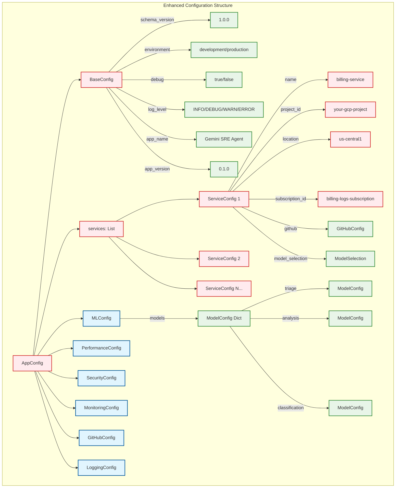

# Configuration Guide

The Gemini SRE Agent's behavior is highly configurable through the enhanced configuration management system. This guide details the new type-safe configuration structure and options available to tailor the agent to your specific monitoring and remediation needs.

## Enhanced Configuration System

The new configuration system provides:

- **Type-safe configuration** with Pydantic models and comprehensive validation
- **Environment variable integration** with `pydantic-settings`
- **Multiple format support** (YAML, TOML, JSON)
- **Hot reloading** capabilities for runtime configuration updates
- **CLI tools** for validation, migration, and management
- **Comprehensive monitoring** and audit logging

## Configuration Structure

The main configuration file uses a modern, type-safe structure with schema versioning and environment support.



### Configuration Hierarchy

The enhanced configuration system follows a modern, type-safe structure with:

- **Schema versioning** for configuration compatibility
- **Environment-specific settings** for different deployment environments
- **Type validation** with comprehensive error messages
- **Environment variable integration** for sensitive data
- **Hot reloading** capabilities for runtime updates

```yaml
schema_version: "1.0.0"
environment: "development"
debug: false
log_level: "INFO"
app_name: "Gemini SRE Agent"
app_version: "0.1.0"

services:
  - name: "billing-service"
    project_id: "your-gcp-project"
    location: "us-central1"
    subscription_id: "billing-logs-subscription"
    github:
      repository: "owner/repo"
      base_branch: "main"
    model_selection:
      triage_model: "gemini-flash"
      analysis_model: "gemini-pro"
      classification_model: "gemini-flash-lite"

  - name: "auth-service"
    project_id: "your-gcp-project"
    location: "us-central1"
    subscription_id: "auth-logs-subscription"
    # Uses global ML and GitHub settings

ml:
  models:
    triage:
      name: "gemini-flash"
      max_tokens: 8192
      temperature: 0.1
      cost_per_1k_tokens: 0.000075
      type: "FLASH"
    analysis:
      name: "gemini-pro"
      max_tokens: 32768
      temperature: 0.3
      cost_per_1k_tokens: 0.0005
      type: "PRO"
    classification:
      name: "gemini-flash-lite"
      max_tokens: 4096
      temperature: 0.1
      cost_per_1k_tokens: 0.0000375
      type: "FLASH_LITE"

performance:
  max_concurrent_requests: 10
  request_timeout_seconds: 30
  retry_attempts: 3
  cache_ttl_seconds: 3600

security:
  enable_pii_sanitization: true
  enable_audit_logging: true
  max_log_size_mb: 10

monitoring:
  enable_metrics: true
  metrics_retention_days: 30
  alert_thresholds:
    error_rate_percent: 5.0
    response_time_ms: 5000

github:
  repository: "owner/repo"
  base_branch: "main"
  auto_merge: false
  require_reviews: 1

logging:
  level: "INFO"
  format: "json"
  file_path: null
  max_file_size_mb: 100
  backup_count: 5
```

## Configuration Sections

### Base Configuration

The base configuration provides fundamental application settings:

- **`schema_version`** (`str`): Configuration schema version for compatibility checking (e.g., `"1.0.0"`).
- **`environment`** (`str`): Deployment environment (`"development"`, `"staging"`, `"production"`).
- **`debug`** (`bool`): Enable debug mode for detailed logging and error reporting.
- **`log_level`** (`str`): Minimum logging level (`"DEBUG"`, `"INFO"`, `"WARN"`, `"ERROR"`).
- **`app_name`** (`str`): Application name for identification and logging.
- **`app_version`** (`str`): Application version for tracking and compatibility.

### Services Configuration

The `services` section defines a list of services to monitor. Each service configuration includes:

- **`name`** (`str`): Unique service identifier (e.g., `"billing-service"`).
- **`project_id`** (`str`): GCP project ID where the service logs reside.
- **`location`** (`str`): GCP region for Vertex AI model access (e.g., `"us-central1"`).
- **`subscription_id`** (`str`): Pub/Sub subscription ID for log ingestion.
- **`github`** (`GitHubConfig`): GitHub repository configuration for this service.
- **`model_selection`** (`ModelSelection`): AI model selection for this service.

### ML Configuration

The `ml` section consolidates all machine learning and AI model settings:

- **`models`** (`Dict[str, ModelConfig]`): Dictionary of model configurations:
  - **`triage`**: Model for initial log triage (fast, cost-effective)
  - **`analysis`**: Model for deep analysis and remediation planning
  - **`classification`**: Model for log classification and pattern detection

Each model configuration includes:

- **`name`** (`str`): Model name (e.g., `"gemini-flash"`, `"gemini-pro"`).
- **`max_tokens`** (`int`): Maximum tokens for model responses.
- **`temperature`** (`float`): Model temperature for response creativity (0.0-1.0).
- **`cost_per_1k_tokens`** (`float`): Cost per 1000 tokens for budget tracking.
- **`type`** (`ModelType`): Model type enum (`"FLASH"`, `"PRO"`, `"FLASH_LITE"`).

### Performance Configuration

The `performance` section controls system performance and optimization:

- **`max_concurrent_requests`** (`int`): Maximum concurrent API requests.
- **`request_timeout_seconds`** (`int`): Request timeout in seconds.
- **`retry_attempts`** (`int`): Number of retry attempts for failed requests.
- **`cache_ttl_seconds`** (`int`): Cache time-to-live in seconds.

### Security Configuration

The `security` section manages security and compliance settings:

- **`enable_pii_sanitization`** (`bool`): Enable PII data sanitization.
- **`enable_audit_logging`** (`bool`): Enable comprehensive audit logging.
- **`max_log_size_mb`** (`int`): Maximum log size in megabytes.

### Monitoring Configuration

The `monitoring` section controls observability and metrics:

- **`enable_metrics`** (`bool`): Enable metrics collection and reporting.
- **`metrics_retention_days`** (`int`): Metrics retention period in days.
- **`alert_thresholds`** (`AlertThresholds`): Alert threshold configuration:
  - **`error_rate_percent`** (`float`): Error rate threshold percentage.
  - **`response_time_ms`** (`int`): Response time threshold in milliseconds.

### GitHub Configuration

The `github` section manages GitHub integration:

- **`repository`** (`str`): GitHub repository in `owner/repo` format.
- **`base_branch`** (`str`): Default base branch for pull requests.
- **`auto_merge`** (`bool`): Enable automatic PR merging.
- **`require_reviews`** (`int`): Number of required reviews for PRs.

### Logging Configuration

The `logging` section controls logging behavior:

- **`level`** (`str`): Logging level (`"DEBUG"`, `"INFO"`, `"WARN"`, `"ERROR"`).
- **`format`** (`str`): Log format (`"json"`, `"text"`).
- **`file_path`** (`Optional[str]`): Log file path (null for console only).
- **`max_file_size_mb`** (`int`): Maximum log file size in megabytes.
- **`backup_count`** (`int`): Number of log file backups to retain.

## Environment Variable Integration

The enhanced configuration system supports loading sensitive configuration from environment variables:

### Setting Environment Variables

```bash
# API Keys and Secrets
export GEMINI_API_KEY="your-gemini-api-key"
export GITHUB_TOKEN="your-github-token"
export GCP_SERVICE_ACCOUNT_KEY="path/to/service-account.json"
export DATABASE_PASSWORD="your-database-password"

# Configuration Overrides
export ENVIRONMENT="production"
export DEBUG="false"
export LOG_LEVEL="INFO"
export MAX_CONCURRENT_REQUESTS="20"
```

### Using .env Files

Create a `.env` file in your project root:

```bash
# .env file
GEMINI_API_KEY=your-gemini-api-key
GITHUB_TOKEN=your-github-token
GCP_SERVICE_ACCOUNT_KEY=path/to/service-account.json
ENVIRONMENT=production
DEBUG=false
LOG_LEVEL=INFO
```

## CLI Tools

The enhanced configuration system includes powerful CLI tools for management:

### Configuration Validation

```bash
# Validate configuration file
python -m gemini_sre_agent.config.cli_tools validate config/config.yaml

# Validate with detailed output
python -m gemini_sre_agent.config.cli_tools validate config/config.yaml --verbose
```

### Template Generation

```bash
# Generate configuration template
python -m gemini_sre_agent.config.cli_tools generate_template --output config/config_template.yaml

# Generate with environment-specific defaults
python -m gemini_sre_agent.config.cli_tools generate_template --environment production --output config/production.yaml
```

### Configuration Migration

```bash
# Migrate from old configuration format
python -m gemini_sre_agent.config.cli_tools migrate --input config/old_config.yaml --output config/new_config.yaml

# Migrate with validation
python -m gemini_sre_agent.config.cli_tools migrate --input config/old_config.yaml --output config/new_config.yaml --validate
```

### Configuration Diffing

```bash
# Compare two configuration files
python -m gemini_sre_agent.config.cli_tools diff config/config.yaml config/config_backup.yaml

# Compare with environment variables
python -m gemini_sre_agent.config.cli_tools diff config/config.yaml --env
```

## Example Scenarios

### Development Environment

```yaml
schema_version: "1.0.0"
environment: "development"
debug: true
log_level: "DEBUG"

services:
  - name: "dev-service"
    project_id: "dev-gcp-project"
    location: "us-central1"
    subscription_id: "dev-logs-sub"
    github:
      repository: "dev-org/dev-repo"
      base_branch: "develop"

ml:
  models:
    triage:
      name: "gemini-flash"
      max_tokens: 4096
      temperature: 0.1
      cost_per_1k_tokens: 0.000075
      type: "FLASH"

performance:
  max_concurrent_requests: 5
  request_timeout_seconds: 60
  retry_attempts: 2
  cache_ttl_seconds: 1800

security:
  enable_pii_sanitization: true
  enable_audit_logging: true
  max_log_size_mb: 5
```

### Production Environment

```yaml
schema_version: "1.0.0"
environment: "production"
debug: false
log_level: "INFO"

services:
  - name: "billing-service"
    project_id: "prod-gcp-project"
    location: "us-central1"
    subscription_id: "billing-logs-sub"
    github:
      repository: "prod-org/billing-repo"
      base_branch: "main"
      auto_merge: false
      require_reviews: 2

  - name: "auth-service"
    project_id: "prod-gcp-project"
    location: "us-central1"
    subscription_id: "auth-logs-sub"
    github:
      repository: "prod-org/auth-repo"
      base_branch: "main"
      auto_merge: false
      require_reviews: 2

ml:
  models:
    triage:
      name: "gemini-flash"
      max_tokens: 8192
      temperature: 0.1
      cost_per_1k_tokens: 0.000075
      type: "FLASH"
    analysis:
      name: "gemini-pro"
      max_tokens: 32768
      temperature: 0.3
      cost_per_1k_tokens: 0.0005
      type: "PRO"

performance:
  max_concurrent_requests: 20
  request_timeout_seconds: 30
  retry_attempts: 3
  cache_ttl_seconds: 3600

security:
  enable_pii_sanitization: true
  enable_audit_logging: true
  max_log_size_mb: 50

monitoring:
  enable_metrics: true
  metrics_retention_days: 90
  alert_thresholds:
    error_rate_percent: 2.0
    response_time_ms: 3000

logging:
  level: "INFO"
  format: "json"
  file_path: "/var/log/gemini-sre-agent.log"
  max_file_size_mb: 100
  backup_count: 10
```

### Multi-Environment Setup

For managing multiple environments, you can use environment-specific configuration files:

```bash
# Development
config/config.dev.yaml

# Staging
config/config.staging.yaml

# Production
config/config.prod.yaml
```

Load environment-specific configuration:

```python
from gemini_sre_agent.config import ConfigManager
import os

environment = os.getenv('ENVIRONMENT', 'development')
config_file = f"config/config.{environment}.yaml"

config_manager = ConfigManager(config_file)
config = config_manager.reload_config()
```

## Migration from Legacy System

If you're migrating from the legacy configuration system, refer to the [Configuration Migration Guide](CONFIG_MIGRATION_GUIDE.md) for detailed migration instructions and examples.

## Best Practices

1. **Use Environment Variables**: Store sensitive data like API keys in environment variables or `.env` files.
2. **Validate Configuration**: Always validate your configuration using the CLI tools before deployment.
3. **Version Control**: Keep configuration files in version control, but exclude `.env` files.
4. **Environment Separation**: Use separate configuration files for different environments.
5. **Schema Versioning**: Always specify the `schema_version` for compatibility tracking.
6. **Hot Reloading**: Use the hot reloading feature for development, but restart services in production for configuration changes.

By leveraging these enhanced configuration capabilities, the Gemini SRE Agent provides a robust, type-safe, and flexible solution for managing diverse cloud environments with comprehensive validation and monitoring.
