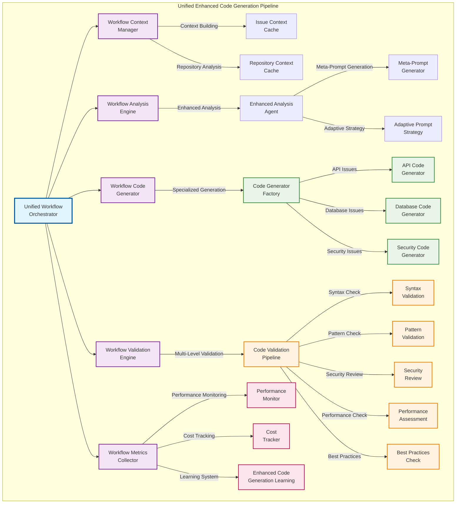

# Unified Enhanced Code Generation System

## Overview

The Unified Enhanced Code Generation System represents a significant advancement in AI-powered incident response, providing a complete end-to-end solution for automated code generation, validation, and deployment in SRE workflows. This system combines specialized code generators, multi-level validation, performance optimization, and adaptive learning to deliver intelligent, context-aware remediation capabilities.

## System Architecture

The system is built around a modular architecture that separates concerns while maintaining tight integration between components:



## Core Components

### 1. Unified Workflow Orchestrator

The central coordination hub that manages the entire code generation workflow from analysis to validation.

**Key Features:**

- **Central Coordination**: Manages the entire code generation workflow from analysis to validation
- **Modular Architecture**: Broken down into specialized workflow components for maintainability
- **Async Optimization**: Concurrent task execution with priority queuing and retry mechanisms
- **Performance Monitoring**: Real-time metrics collection and trend analysis

**Implementation:**

- `UnifiedWorkflowOrchestrator`: Main orchestrator class
- `WorkflowContextManager`: Manages context building and caching
- `WorkflowAnalysisEngine`: Handles analysis execution and fallback logic
- `WorkflowCodeGenerator`: Manages code generation and enhancement
- `WorkflowValidationEngine`: Manages validation and quality checking
- `WorkflowMetricsCollector`: Collects metrics and provides performance insights

### 2. Enhanced Analysis Engine

Provides context-aware analysis incorporating repository structure, recent commits, and issue patterns.

**Key Features:**

- **Context-Aware Analysis**: Incorporates repository structure, recent commits, and issue patterns
- **Meta-Prompt Generation**: Uses AI to generate optimized prompts for better code generation
- **Adaptive Strategy Selection**: Chooses optimal analysis approach based on issue complexity
- **Fallback Mechanisms**: Graceful degradation to simpler approaches when needed

**Implementation:**

- `EnhancedAnalysisAgent`: Main analysis agent with dynamic prompt generation
- `MetaPromptGenerator`: Generates optimized prompts using AI
- `AdaptivePromptStrategy`: Selects optimal prompt generation strategy
- `PromptContextModels`: Data models for prompt context and task information

### 3. Specialized Code Generators

Domain-specific code generators for different types of issues.

**Key Features:**

- **API Code Generator**: Handles authentication, rate limiting, endpoint failures, response validation
- **Database Code Generator**: Manages connection issues, query optimization, deadlocks, migrations
- **Security Code Generator**: Addresses vulnerability assessment, access control, encryption problems
- **Factory Pattern**: Dynamic generator selection based on issue type and context

**Implementation:**

- `CodeGeneratorFactory`: Factory for creating specialized code generators
- `APICodeGenerator`: Specialized generator for API-related issues
- `DatabaseCodeGenerator`: Specialized generator for database-related issues
- `SecurityCodeGenerator`: Specialized generator for security-related issues
- `BaseCodeGenerator`: Base class for all code generators

### 4. Multi-Level Validation Pipeline

Comprehensive validation system ensuring code quality and compliance.

**Key Features:**

- **Syntax Validation**: Ensures generated code is syntactically correct
- **Pattern Validation**: Verifies code follows established patterns and conventions
- **Security Review**: Identifies potential security vulnerabilities and compliance issues
- **Performance Assessment**: Evaluates performance impact and optimization opportunities
- **Best Practices Check**: Ensures adherence to coding standards and architectural principles

**Implementation:**

- `CodeValidationPipeline`: Main validation pipeline
- `ValidationResult`: Data model for validation results
- `ValidationIssue`: Data model for validation issues
- `ValidationFeedback`: Data model for validation feedback

### 5. Performance & Cost Management

Intelligent resource management and cost optimization.

**Key Features:**

- **Adaptive Rate Limiting**: Smart API request management with circuit breaker patterns
- **Cost Tracking**: Real-time budget monitoring with configurable limits and alerts
- **Performance Monitoring**: Comprehensive metrics collection and trend analysis
- **Async Optimization**: Concurrent processing with intelligent task prioritization

**Implementation:**

- `AdaptiveRateLimiter`: Smart rate limiting with circuit breaker patterns
- `CostTracker`: Real-time cost tracking and budget management
- `PerformanceMonitor`: Comprehensive performance monitoring
- `AsyncOptimizer`: Concurrent task execution and optimization

### 6. Learning & Improvement System

Continuous learning and improvement based on generation history and feedback.

**Key Features:**

- **Generation History Tracking**: Records successful and failed code generation attempts
- **Pattern Learning**: Identifies successful patterns for future use
- **Feedback Integration**: Incorporates validation results to improve future generations
- **Performance Insights**: Provides actionable recommendations for system optimization

**Implementation:**

- `EnhancedCodeGenerationLearning`: Learning system for code generation
- `GenerationHistory`: Data model for generation history
- `LearningInsights`: Data model for learning insights
- `PerformanceMetrics`: Data model for performance metrics

## Key Capabilities

### Intelligent Code Generation

**Context-Aware Generation:**

- Incorporates repository structure, recent changes, and issue patterns
- Uses specialized generators for different types of issues
- Leverages different Gemini models for optimal results
- Implements iterative refinement based on validation feedback

**Specialized Approaches:**

- **API Issues**: Authentication, rate limiting, endpoint failures, response validation
- **Database Issues**: Connection problems, query optimization, deadlocks, migrations
- **Security Issues**: Vulnerability assessment, access control, encryption problems
- **Performance Issues**: Resource optimization, caching strategies, scaling solutions

### Quality Assurance

**Multi-Level Validation:**

- **Syntax Validation**: Ensures generated code is syntactically correct
- **Pattern Validation**: Verifies code follows established patterns and conventions
- **Security Review**: Identifies potential security vulnerabilities and compliance issues
- **Performance Assessment**: Evaluates performance impact and optimization opportunities
- **Best Practices Check**: Ensures adherence to coding standards and architectural principles

**Automated Testing Integration:**

- Integration with existing test suites and validation frameworks
- Code review integration with detailed explanations
- Compliance checking for security and coding standards

### Performance Optimization

**Concurrent Processing:**

- Async task execution for improved throughput
- Intelligent caching to reduce API costs
- Resource management with adaptive rate limiting
- Cost control with budget monitoring and automatic throttling

**Intelligent Caching:**

- Context and response caching to reduce API costs
- Similarity-based matching for cost optimization
- Performance monitoring and trend analysis

### Learning & Adaptation

**Success Pattern Recognition:**

- Identifies and reuses successful generation patterns
- Learns from failed attempts to improve future generations
- Continuous optimization based on metrics and feedback
- Dynamic adjustment of generation approaches based on success rates

## Implementation Status

### Phase 1: Core Foundation ✅

- [x] Core data models and base code generator
- [x] Enhanced analysis agent integration
- [x] API and security code generators
- [x] Unified code generation system integration

### Phase 2: Advanced Integration & Workflow Orchestration ✅

- [x] Comprehensive performance optimization system
- [x] Advanced integration and workflow orchestration
- [x] Quality assurance integration
- [x] Modular architecture refactoring

### Phase 3: Performance & Cost Optimization ✅

- [x] Adaptive rate limiting with circuit breaker patterns
- [x] Cost tracking and budget management
- [x] Performance monitoring and metrics collection
- [x] Async optimization and concurrent processing

### Phase 4: Quality Assurance & Validation ✅

- [x] Multi-level validation pipeline
- [x] Code quality assessment
- [x] Security review and compliance checking
- [x] Best practices validation

### Phase 5: Learning & Improvement ✅

- [x] Generation history tracking
- [x] Pattern learning and recognition
- [x] Feedback integration
- [x] Performance insights and recommendations

## Usage Examples

### Basic Code Generation

```python
from gemini_sre_agent.ml.unified_workflow_orchestrator import UnifiedWorkflowOrchestrator

# Initialize the orchestrator
orchestrator = UnifiedWorkflowOrchestrator()

# Execute workflow for an issue
result = await orchestrator.execute_workflow(
    issue_context={
        "type": "API_ERROR",
        "description": "Authentication failure in user service",
        "severity": "HIGH"
    },
    repository_context={
        "path": "/path/to/repo",
        "recent_commits": [...],
        "dependencies": [...]
    }
)

# Get generated code and validation results
generated_code = result.generated_code
validation_result = result.validation_result
```

### Specialized Code Generation

```python
from gemini_sre_agent.ml.code_generator_factory import CodeGeneratorFactory

# Get specialized generator
factory = CodeGeneratorFactory()
generator = factory.get_generator("API_ERROR")

# Generate code for specific issue
code = await generator.generate_code(
    issue_context=issue_context,
    repository_context=repository_context
)
```

### Validation and Quality Assurance

```python
from gemini_sre_agent.ml.validation import CodeValidationPipeline

# Initialize validation pipeline
pipeline = CodeValidationPipeline()

# Validate generated code
result = await pipeline.validate_code(
    code=generated_code,
    context=validation_context
)

# Check validation results
if result.is_valid:
    print("Code passed all validation checks")
else:
    for issue in result.issues:
        print(f"Validation issue: {issue.message}")
```

## Configuration

The system can be configured through the main configuration file:

```yaml
# config/config.yaml
unified_code_generation:
  enabled: true
  validation:
    enabled: true
    strict_mode: true
    security_review: true
    performance_check: true
  performance:
    async_optimization: true
    rate_limiting: true
    cost_tracking: true
  learning:
    enabled: true
    history_tracking: true
    pattern_learning: true
```

## Performance Metrics

The system provides comprehensive performance metrics:

- **Generation Success Rate**: Percentage of successful code generations
- **Validation Pass Rate**: Percentage of code that passes validation
- **Average Generation Time**: Time taken to generate code
- **Cost per Generation**: API costs per code generation
- **Cache Hit Rate**: Percentage of cache hits for context and responses
- **Learning Effectiveness**: Improvement in generation quality over time

## Troubleshooting

### Common Issues

1. **Generation Failures**: Check issue context and repository context validity
2. **Validation Errors**: Review validation configuration and code quality
3. **Performance Issues**: Monitor rate limiting and cost tracking
4. **Learning Problems**: Check generation history and feedback integration

### Debug Mode

Enable debug mode for detailed logging:

```yaml
logging:
  level: DEBUG
  unified_code_generation: true
```

## Future Enhancements

- **Multi-Language Support**: Support for additional programming languages
- **Advanced Learning**: Machine learning-based pattern recognition
- **Integration Expansion**: Support for additional CI/CD tools and platforms
- **Real-time Collaboration**: Multi-user code generation and review
- **Advanced Analytics**: Detailed performance and quality analytics

## Contributing

Contributions to the Unified Enhanced Code Generation System are welcome. Please see the [Development Guide](DEVELOPMENT.md) for details on how to contribute.

## License

This project is licensed under the MIT License - see the [LICENSE](../../LICENSE) file for details.
